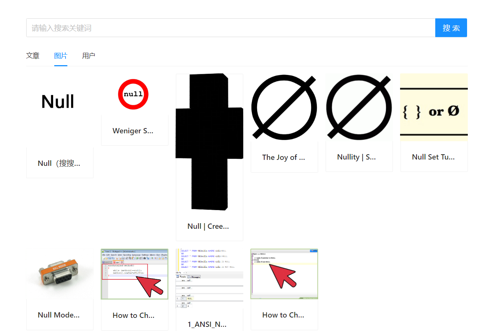

# searchCenter 搜索中台
基于 Spring Boot + Elastic Stack (+ Vue 3) 的一站式信息聚合搜索平台。用户可在同一页面集中搜索出不司来源、不同类型的内容如文童、图片、用户，提升搜索体验。
企业也可以直接将各项目的数据接入搜索平台，复用同一套搜索后端，提升开发效率、降低系统维护成本。 
## 项目特点
1. 基于自己二次开发的 Spring Boot 初始化模板 + MyBatis X 插件，快速生成基本数据源的增删改查 。
2. 数据源获取:
    使用 HttpClient 请求 离线 获取外部网站的文章，并使用 Hutool 的JSONUtil 解析和预处理文章，最终 入库。
    使用 jsoup 实时请求 bing 搜索接口获取图片，并使用 CSS Selector 语法解析和预处理图片信息，最终返回给前端。
3. 为实现多类数据源的整体搜索，使用门面模式 在后端对各类数据源的搜索结果进行聚合，统一返回给前端减少了前端请求次数(N 次到1次)以及前端开发复杂度。并通过 CompletableFuture 并发搜索各数据源进一步提升搜索接口性能，实测整体响应时长 由 300ms 减少为 xx ms (一定要自己测试，如果效果不明显，可以加大数据量)
4. 为提高聚合搜索接口的通用性，首先通过定义数据源接口来实现统一的数据源接入标准(比如新数据源必须支4.持分页)，当新数据源(比如视频)要接入时，只需使用适配器模式对其数据查询接口进行封装、以适配数据源接口，无须修改原有代码，提高了系统的可扩展性。
5. 为减少代码的圈复杂度，使用注册聚模式代替 if else 来管理多人数据源对象，调用方可根据名称轻松获取对象，(使用 IDEA MetricReloaded 插件)实测圈复杂度由 XX 减少为 XX
6. 为解决文竟搜不出的问题，自主搭建 Elasticsearch 来代替 MySQL 的模糊查询，并通过为索引绑定 ik 分词器实现了更灵活的分词搜索，且使用 JMeter 测试后发现搜索性能提升 xx% (xx qps 到 xx qps)构建 ES 文竟索引时，采用动静分离的策略，只在 ES 中存储要检索的、修改不频繁字段(比如文音) 用于检索，而修改频繁的字段(比如点赞数)从数据库中关联查出，从而减少了 ES 数据更新和同步的成本、保证数据一致性。
7. 为了更方便地管理 Elasticsearch 中的数据，自主搭建 Kibana 并配置 index pattern 和看板，实现对文竟数8据的可视化管理。
8. 使用 Knife4i + Swagger 自动生成后端接口文档，并通过编写 ApiOperation 等注解补充接口注释，避免了人工编写维护文档的麻烦。

### 待优化点
1. 可以使用 Canal 监听 MySQL，并将数据实时同步到 Elasticsearch (一定要能突出实时同步的必要性，比如要搜索的数据频繁改动)
2. 可以使用 Redis 对查询数据进行缓存，并测试下缓存命中率和性能提升的效果
3. 可以记录并统计用户的搜索词，从而实现热搜、词云图、看板分析等功能。
4. 为 Elasticsearch 的 ik 插件自定义词典，实现系统内一些关键词的灵活分词查询。(词典如何生成也是需要考虑的问题，可以从热搜词下手)
5. 使用 Elasticsearch 的 highlight 语法实现搜索词高亮
6. 使用 Elasticsearch 的 suggest 语法实现搜索建议
7. 聚合搜索接口中，可以使用自定义线程池来实现并发，线程池的参数配置为 0 密集型，即线程数多一些
8. 可以使用 Guava Retrving 重试库来保证调用第三方接口的稳定性，可以实测一下接口可用性有几个9
9. 可以使用定时任务定期去做离线文章爬虫。
10. 可以引入别的业务的搜索功能,改造成微服务。

### 项目演示

